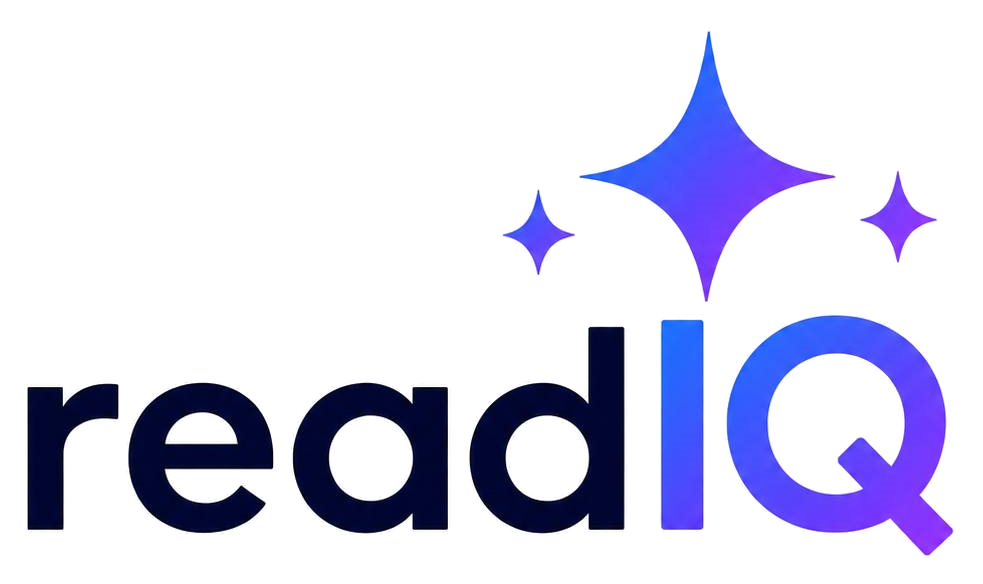
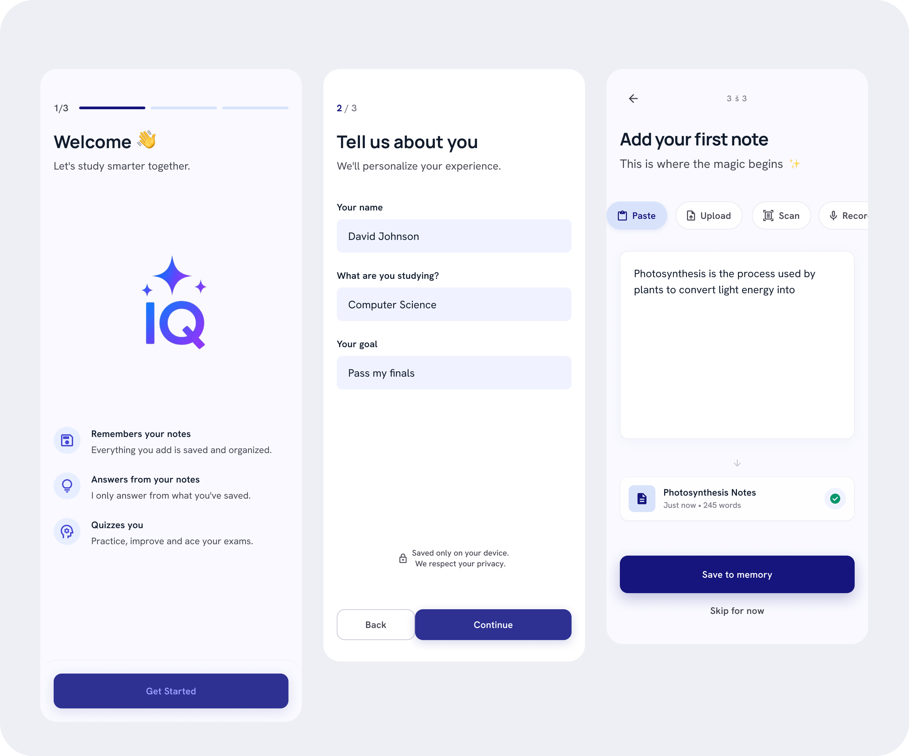
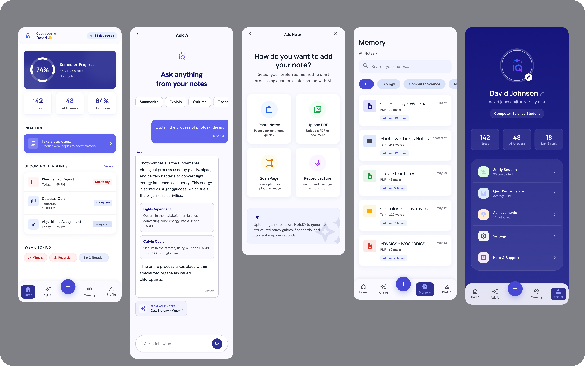
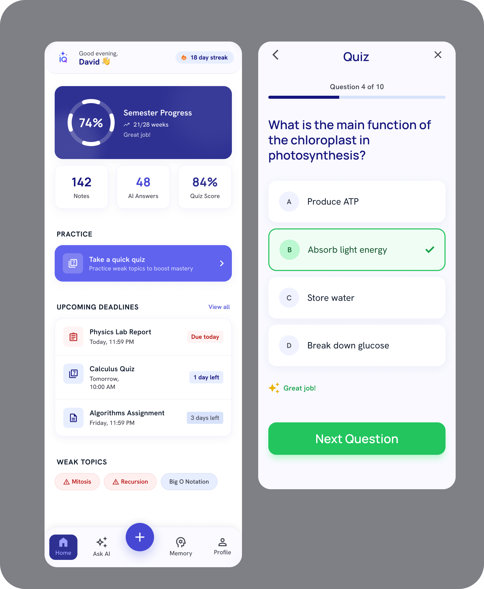
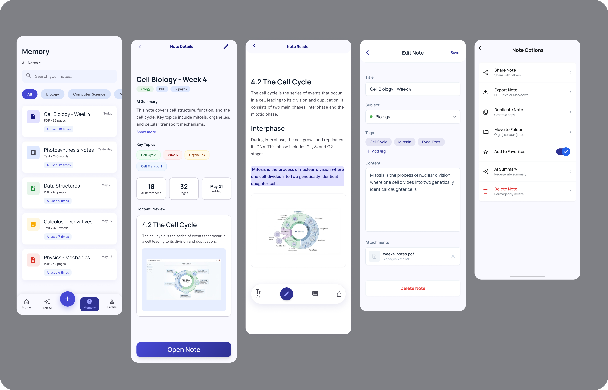
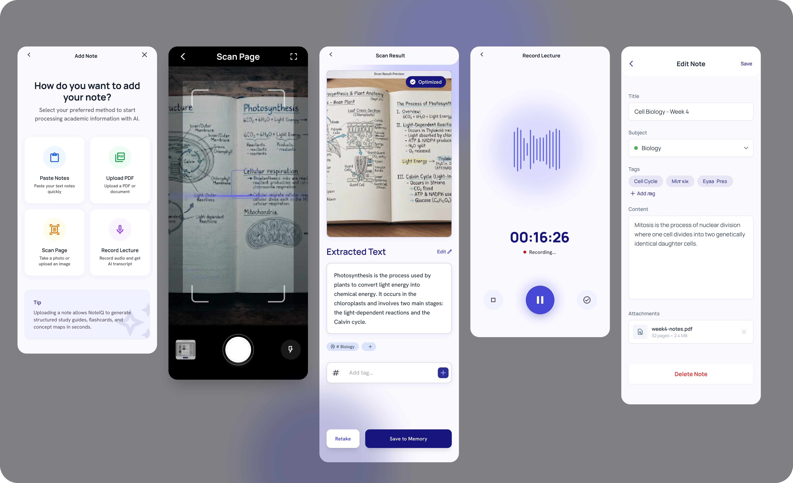
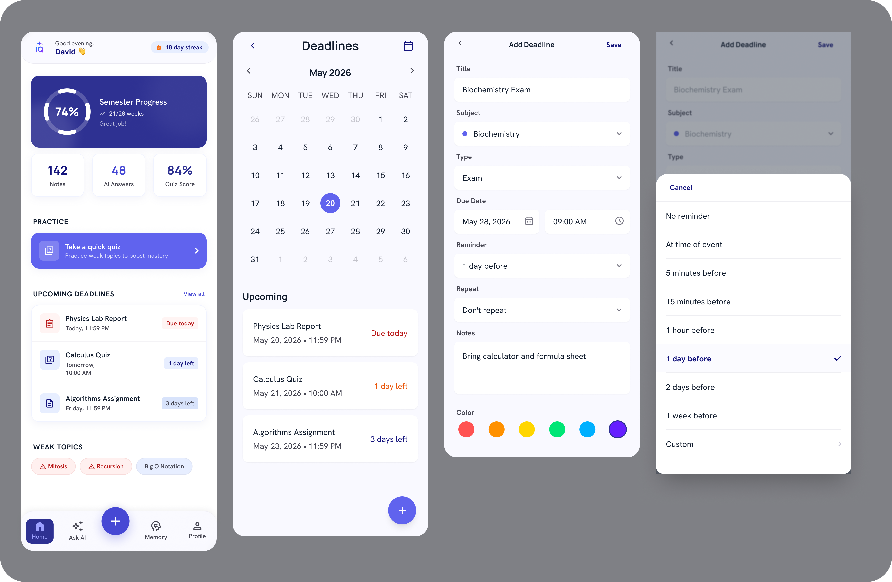
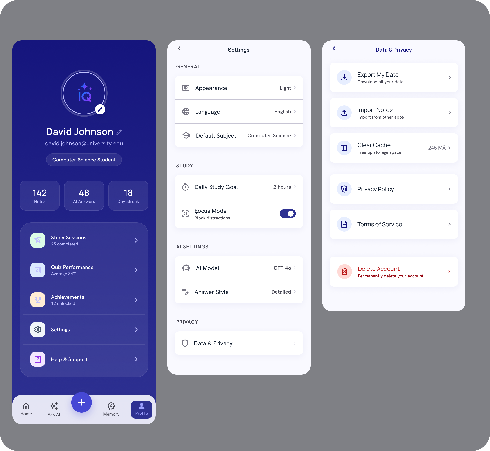

<div align="center">



# readIQ

**Your AI study companion that only answers from _your_ notes.**
_Notes in. Trustworthy answers out. Every answer proven with a 📌 From your notes tag._

<p>▶️ &nbsp; <a href="#12-demo-video"><strong>Watch the Demo</strong></a> &nbsp; · &nbsp; 💻 &nbsp; <a href="https://github.com/muhaj-dev/ReadIQ"><strong>GitHub Repo</strong></a> &nbsp; · &nbsp; 🧠 &nbsp; <a href="#9-btl-runtime-usage"><strong>How we use the BTL Runtime</strong></a></p>

Built for the **BTL Runtime Hackathon** by **Bad Theory Labs** (badtheorylabs.com) · July 3–5, 2026.

</div>

---

## Table of Contents

1. [Project Overview](#1-project-overview)
2. [Problem Statement](#2-problem-statement)
3. [Solution](#3-solution)
4. [Features](#4-features)
5. [Screenshots](#5-screenshots)
6. [Tech Stack](#6-tech-stack)
7. [Architecture](#7-architecture)
8. [Installation](#8-installation)
9. [BTL Runtime Usage](#9-btl-runtime-usage)
10. [Challenges](#10-challenges)
11. [Future Work](#11-future-work)
12. [Demo Video](#12-demo-video)
13. [Trust & Grounding Promise](#13-trust--grounding-promise)
14. [Submission Summary](#14-submission-summary)
15. [Team & License](#15-team--license)

---

## 1. Project Overview

**readIQ** is a calm, organized AI study partner that **remembers a student's notes** and answers questions using **only what they've saved** — and proves it with a small **📌 From your notes** tag naming the exact source note.

A student adds notes four ways — **paste text, upload a file (PDF / .docx), snap a photo (AI reads it), or record a lecture** — and readIQ turns that raw material into a trustworthy study tool: a grounded chat, auto-generated quizzes, colour-coded deadlines, streaks, and weak-topic tracking.

**Every intelligent step is powered by the BTL Runtime** — Bad Theory Labs' OpenAI-compatible LLM gateway. Notes are stored locally on the device as the source of truth; the runtime is used to read, retrieve, generate, and quiz.

> ### The idea in one sentence
>
> When a stressed student sees **📌 From your notes** under an answer, they trust the app. That tag — the visible proof the app never makes anything up — is the emotional core of readIQ. If an answer can't be grounded in a real saved note, readIQ says so honestly instead of inventing one.

---

## 2. Problem Statement

University students revising for exams are anxious and time-poor. General AI chatbots will confidently answer *anything* — including things that aren't in the syllabus, aren't from the lecturer, and sometimes aren't even true. A student can't tell a grounded fact from a hallucination, so they can't trust the tool with the one thing that matters most: **getting the exam answer right.**

Meanwhile their actual study material — lecture slides, handwritten notes, recorded classes, PDFs — sits scattered across apps and folders, never turned into something they can revise from.

The result: students either don't use AI for revision, or they use it and quietly worry it's lying to them.

---

## 3. Solution

readIQ answers questions **only from the student's own saved notes**, and shows the receipt.

A student saves notes → readIQ splits and indexes them → when the student asks a question, readIQ **retrieves the relevant note chunks first**, and only then asks the model to answer **using those chunks alone**. If nothing relevant is found, it refuses to guess. Every grounded answer streams in live and carries a tappable **📌 From your notes: _<title>_** citation.

The same grounded material powers **quizzes** (MCQs generated only from a subject's notes, with a "why" for every miss), while **Scan** and **Record** use BTL vision and transcription to turn photos and lectures into notes in the first place.

**Trust is enforced by architecture** — the retrieval gate — **not just by a polite system prompt.**

---

## 4. Features

| Feature | What it does | BTL Runtime capability |
|---|---|---|
| 💬 **Ask ★ (grounded chat)** | Answers **only** from saved notes; streams live; tags every answer **📌 From your notes** (tap → source). Honest fallback when nothing matches. | `chat/completions` **(streamed)** — `btl-2` |
| 🧠 **Memory Panel** | A live, searchable list of every saved note — the visible proof the app remembers | — (local SQLite) |
| 📝 **Auto-Quiz** | Generates grounded MCQs per subject, scores the run, reveals the correct option + a short "why" per miss | `chat/completions` **(JSON)** — `btl-2` |
| 📸 **Scan a note** | Photograph a page (even handwriting); AI reads it into a saved note | `chat/completions` **(vision OCR)** — `gemini-2.5-flash` |
| 📄 **Upload a file** | PDF → text via BTL vision · .docx → text on-device (jszip); summarized and saved | `chat/completions` **(vision)** — `gemini-2.5-flash` |
| 🎙️ **Record a lecture** | Records class audio, transcribes it, summarizes and saves it as a note | Transcription via Whisper → summary on `btl-2` |
| 🎧 **Broadcast a note** | Turns a single saved note into a two-host audio conversation ("From Your Notes") the student **listens** to — script grounded **only** in that note, played aloud on-device. Reachable from Note Details and the reader toolbar. | `chat/completions` — `btl-2` |
| 📅 **Deadlines** | Colour-coded exam/assignment dates with countdowns, a calendar, and reminder toggles | — (local SQLite) |
| 📈 **Progress** | Streaks, quiz scores, and weak-topic tracking that show improvement over time | — |
| 📖 **PDF Reader** | Renders an uploaded PDF exactly, with on-page highlight + comment + listen | — (on-device pdf.js) |
| 🎨 **Calm, polished UI** | Notion-meets-Duolingo light theme — rounded cards, soft shadows, generous white space, tuned to reduce exam anxiety | — |

---

## 5. Screenshots

### Onboarding — _the magic first moment_
Welcome → tell us about you → add your first note and watch it fly into Memory.



### Home & Ask ★ — _the star feature_
Dashboard (semester progress, streak, deadlines, weak topics) · **Ask AI** answering from saved notes with a **📌 From your notes** tag · Add Note · Memory · Profile.



### Ask ★ + grounded Quiz
A grounded answer with its source citation, and a quiz question generated only from the student's notes with instant green/red feedback.



### Memory — _the visible proof the app remembers_
Every saved note as a card · Note Details (AI summary + key topics) · Note Reader (highlight + comment) · Edit Note · Note Options.



### Add a note — Paste · Upload · Scan · Record
Choose a method → scan a page (BTL vision OCR reads it) → confirm the extracted text → or record a lecture and transcribe it.



### Deadlines
Colour-coded exam/assignment dates, a month calendar with deadline dots, countdowns, and reminder options.



### Profile & Settings
Profile stats (notes · AI answers · streak · achievements) · Settings (appearance, AI model, answer style) · Data & Privacy.



> 🖼️ **Adding the images:** save each pasted screenshot into `docs/screenshots/`
> using the exact filenames above — see [`docs/screenshots/README.md`](docs/screenshots/README.md)
> for the image-to-filename mapping.

---

## 6. Tech Stack

**Frontend / Mobile**
- Expo SDK 54 · React Native 0.81 · TypeScript (strict)
- Expo Router (file-based routing)
- NativeWind v4 / Tailwind CSS v3 — layout via `className`, colours via `useTheme()`
- Fonts: Manrope + Hanken Grotesk

**AI — all via the BTL Runtime**
- **BTL Runtime** — OpenAI-compatible LLM gateway (`/v1/chat/completions`, `/v1/models`)
- A single thin client in [`src/lib/btl.ts`](src/lib/btl.ts) — the **only** file that reads BTL credentials
- Default chat model **`btl-2`** · vision/OCR model **`gemini-2.5-flash`** (both behind the gateway)

**State & Storage (local)**
- Zustand — global app state
- `expo-sqlite` — notes, chunks, deadlines, quiz history (the source of truth)
- AsyncStorage — profile, settings, theme preference

**Native capabilities**
- `expo-camera` + `expo-image-picker` — Scan (photo → OCR)
- `expo-audio` — lecture Record
- `expo-document-picker` + `expo-file-system` — Upload (PDF / .docx)
- `react-native-webview` + pdf.js — exact PDF rendering with annotations
- `jszip` — on-device .docx extraction (zero BTL credits)
- `expo-speech` — study-podcast read-aloud

---

## 7. Architecture

```text
┌──────────────────────────── USER'S PHONE ────────────────────────────┐
│                                                                       │
│   Add a note (paste · upload · scan · record)                         │
│        │                                                              │
│        ▼                                                              │
│   ┌──────────────┐   split into chunks   ┌────────────────────────┐   │
│   │  expo-sqlite │ ◄──────────────────── │  lib/retrieval.ts      │   │
│   │  (notes,     │                       │  (chunk + lexical rank)│   │
│   │   chunks)    │ ────── top-K ───────► │   = the GROUNDING GATE │   │
│   └──────────────┘                       └───────────┬────────────┘   │
│                                                       │ retrieved chunks
│   Ask a question ─────────────────────────────────────┤              │
│                                                       ▼               │
│                              ┌──────────────────────────────────────┐ │
│                              │        lib/btl.ts (only cred reader)  │ │
│                              └───────────────────┬──────────────────┘ │
└──────────────────────────────────────────────────┼────────────────────┘
                                                    │ HTTPS (OpenAI-compatible)
                                                    ▼
                        ┌────────────────────────────────────────────┐
                        │            BTL RUNTIME GATEWAY             │
                        │  /v1/chat/completions  ·  /v1/models       │
                        │  btl-2 (chat/quiz/summary/podcast)         │
                        │  gemini-2.5-flash (scan OCR · PDF read)    │
                        └───────────────────┬────────────────────────┘
                                            │ streamed answer + citations
                                            ▼
                    📌 From your notes: <title>  (tappable → note detail)

   ⚠️  No chunk clears the retrieval bar? readIQ never calls the model —
       it returns "I don't have that in your notes yet." + an "Add a note" action.
```

### Project structure
```text
src/
  app/          Expo Router screens (onboarding, tabs, add, quiz, note, deadlines, settings)
  components/    UI grouped by feature (ask, add, memory, quiz, deadlines, note, …)
  lib/
    btl.ts          the ONLY file that reads BTL credentials (OpenAI-compatible client)
    chat.ts         grounded RAG orchestrator: retrieve → stream → citations
    retrieval.ts    chunk + lexical ranking (the grounding gate)
    quizgen.ts      grounded MCQ generation (JSON)
    ocr.ts          scan photo → text (BTL vision)
    document-extract.ts / pdf-extract.ts / docx-extract.ts   upload extraction
    transcription.ts  lecture audio → text (Whisper — the one non-BTL path)
    db.ts           SQLite helpers (no raw SQL in screens)
  store/         Zustand stores (notes, chat, quiz, deadlines, user, settings, theme)
  constants/     colors.ts (light/dark tokens) · typography.ts · images.ts
  hooks/  types/  data/
```

### App flow
```text
Onboarding (name · what you're studying for · first note)
      │
      ▼
   HOME ──► Ask ★ (grounded answer + 📌 tag)   ·   Generate Quiz   ·   Add Deadline
      │
   Add Note ──► Paste · Upload · Scan · Record ──► saved to Memory
      │
   MEMORY (every note) ── QUIZ (grounded MCQs) ── DEADLINES (calendar + countdowns)
```
Bottom navigation: **HOME · ASK · [ + Add ] · MEMORY · QUIZ · DEADLINES**.

---

## 8. Installation

> readIQ is built with **Expo** and runs in **Expo Go** — no dev build required for the core flow.

### Prerequisites
- Node.js 18+
- Expo Go on a phone (iOS/Android) or an emulator
- A scoped **BTL Runtime API key** (issued for the hackathon)

### Steps
```bash
# 1. Install dependencies
npm install

# 2. Configure credentials
cp .env.example .env
#    then set, at minimum:
#      EXPO_PUBLIC_BTL_API_KEY   = <your scoped BTL hackathon key>
#      EXPO_PUBLIC_BTL_BASE_URL  = https://api.badtheorylabs.com/v1


# 3. Run
npm start          # then press a / i, or scan the QR with Expo Go
```

Other scripts: `npm run android` · `npm run ios` · `npm run web` · `npm run lint` · `npm run typecheck`.

> Without a BTL key the UI still runs and shows an honest *"AI is not set up yet"* message — it never crashes with a raw error.

### Environment variables
| Variable | Required | Purpose |
|---|---|---|
| `EXPO_PUBLIC_BTL_API_KEY` | ✅ | Scoped BTL runtime key — read only in `lib/btl.ts` |
| `EXPO_PUBLIC_BTL_BASE_URL` | ✅ | BTL gateway base URL (includes `/v1`) |
| `EXPO_PUBLIC_OPENAI_API_KEY` | optional | Whisper transcription for lecture Record |
| `EXPO_PUBLIC_OPENAI_BASE_URL` | optional | Override for a Whisper-compatible host (e.g. Groq) |
| `EXPO_PUBLIC_OPENAI_STT_MODEL` | optional | Whisper model name (default `whisper-1`) |

`.env` is git-ignored. Never commit it.

---

## 9. BTL Runtime Usage

**Every AI capability in readIQ is powered by the BTL Runtime** — Bad Theory Labs' OpenAI-compatible gateway at `EXPO_PUBLIC_BTL_BASE_URL` (e.g. `https://api.badtheorylabs.com/v1`). We route **breadth _and_ depth** through it: streamed chat, structured JSON generation, vision OCR, and document reading — all behind a single thin client, [`src/lib/btl.ts`](src/lib/btl.ts), which is the **only** file in the codebase that reads the BTL key.

### Endpoints & models

| # | Job in the app | BTL endpoint | Model | Depth of use |
|---|---|---|---|---|
| 1 | **Grounded Ask ★** (the star) | `POST /v1/chat/completions` · **streamed (SSE)** | `btl-2` | Retrieve note chunks → stream a grounded answer token-by-token → return citations |
| 2 | **Quiz generation** | `POST /v1/chat/completions` · **JSON** | `btl-2` | Grounded MCQs per subject with inline "why" explanations; result cached in SQLite |
| 3 | **Note & lecture summary** | `POST /v1/chat/completions` | `btl-2` | Summarize pasted, uploaded, transcribed, and scanned content into a clean note |
| 4 | **Broadcast script** (two-host podcast) | `POST /v1/chat/completions` | `btl-2` | Two-host "From Your Notes" audio dialogue grounded in a single note |
| 5 | **Scan OCR** (photo → text) | `POST /v1/chat/completions` · **vision** | `gemini-2.5-flash` | Photo sent as an `image_url` content part; reads printed *and* handwritten pages |
| 6 | **PDF text extraction** (upload) | `POST /v1/chat/completions` · **vision** | `gemini-2.5-flash` | PDF read via the same vision content path into the note body |
| 7 | **Connectivity / health check** | `GET /v1/models` | — | Free check (no tokens spent) that gates the "AI is set up" state |

### How each call is made

- **Streaming chat** (Ask ★) uses `expo/fetch` to read the SSE stream and surface `choices[0].delta.content` deltas live — the answer types itself into the chat.
- **Non-streaming chat** (quiz, summary, podcast, OCR, PDF) uses a plain `fetch` `POST` and a tolerant response reader that accepts a plain string, a content-part array, **or** the `/responses` `output` shape — so a gateway shape change never looks like "the model returned nothing".
- **Every failure** maps to a **calm, student-facing sentence** (`not-configured` / `network` / `auth` / `credits` / `server`) — never a raw stack trace, satisfying the rubric's "errors handled gracefully" bar.
- **Credit-thrifty by design:** with only a small scoped credit budget, results are **cached/persisted in SQLite** (quizzes keyed by subject + content hash, notes stored once) so nothing is answered or extracted twice.

### The one documented exception — lecture transcription

BTL has **no working audio-transcription path** — we verified this live during the build:
`/v1/audio/transcriptions` returns **404**, `gpt-audio` **400s** through the gateway, and
`voxtral` tokenizes audio so fast that its 32k context holds **~1 second** of audio. So lecture
**Record** transcribes through a Whisper-compatible endpoint directly (OpenAI, or Groq's free
`whisper-large-v3`), kept isolated to [`src/lib/transcription.ts`](src/lib/transcription.ts) exactly the way the BTL key is isolated to `btl.ts`. **The resulting transcript is then summarized back on `btl-2`**, so the intelligence still lands on BTL. When no transcription key is set, Record degrades gracefully to a manual, editable transcript — it never blocks a save.

### Retrieval note (why lexical, not vectors)

The BTL model catalog surfaced **no dedicated text-embedding model**, so retrieval is **lexical** (keyword / overlap scoring over note chunks) rather than vector cosine similarity. This does **not** weaken the trust promise: grounding is enforced by the **retrieval gate + citations**, not by vectors specifically. The gate is never dropped — if no chunk clears the bar, readIQ refuses to call the model at all.

> **Why route everything through BTL?** It's the hackathon's #1 scoring lever (30 pts + the top tie-breaker) *and* the right architecture: one OpenAI-compatible gateway, one credential file, one place to swap models. Grounded answers, quizzes, OCR, PDF reading, and podcast scripts all flow through it.

---

## 10. Challenges

An honest account of what was hard:

- **Proving BTL couldn't transcribe audio.** We spent real credits verifying three separate audio paths (`/audio/transcriptions`, `gpt-audio`, `voxtral`) before concluding BTL has no viable ASR — then designed the Whisper fallback so the AI summary still runs on `btl-2`.
- **No embedding model in the catalog.** We had to redesign retrieval around lexical scoring while keeping the grounding gate airtight, so "answers only from your notes" holds without vectors.
- **Reading PDFs through a chat gateway.** With no OCR endpoint, we route PDFs and photos through a *vision chat model* as `image_url` content parts — the same proven path for both Scan and Upload.
- **Streaming in React Native.** Standard `fetch` doesn't expose a readable stream in RN; we used `expo/fetch` and hand-parsed the SSE `data:` frames to make Ask ★ feel instant.
- **A tiny credit budget.** ~$0.50 of runtime credits for the whole build *and* demo forced disciplined request-shaping and aggressive SQLite caching so nothing is ever billed twice.
- **Rendering exact PDFs in Expo Go.** We embedded pdf.js in a WebView (no native `react-native-pdf`, no dev build) with geometry-based highlight/comment annotations that re-project at any zoom.

---

## 11. Future Work

- 🔎 **Vector retrieval** if/when a BTL embedding model lands — swap the lexical ranker behind the same gate
- 🗣️ **Flashcard quiz mode** alongside MCQs
- 🔔 **OS deadline notifications** (currently a saved reminder preference, kept dependency-free for Expo Go)
- ⚙️ **In-app model picker** (Settings → AI Model) across the BTL catalog
- 📊 **Deeper progress analytics** — mastery trends per topic over time
- 🌐 **Shared study sets** between classmates

---

## 12. Demo Video

A 2-minute walkthrough hitting the hero moments, in order:

1. **Ask ★** — type a question; watch the answer **stream in** with a **📌 From your notes** tag; tap it to open the source note.
2. **Scan** — snap a page of handwritten notes; BTL vision reads it into a saved note.
3. **Record** — record a short lecture; it transcribes, summarizes, and saves.
4. **Quiz + Deadlines** — generate a grounded quiz from a subject; add a colour-coded exam deadline.

**▶️ Watch the demo:** _add link here before submitting_

---

## 13. Trust & Grounding Promise (Non-Negotiable)

- ✅ No answer ever comes from outside the student's saved notes — it's **retrieval-gated**.
- ✅ Every grounded answer shows its source via the **📌 From your notes** tag, tappable to the note.
- ✅ If nothing can be grounded, readIQ says *"I don't have that in your notes yet."* — it never invents.
- ✅ Notes stay on the device (**SQLite**) as the source of truth; only what's needed is sent to BTL to be answered. We're honest about this in-app.
- ✅ The BTL API key is read in exactly one file, never logged, and never shipped to any analytics service.

---

## 14. Submission Summary

| Requirement | Detail |
|---|---|
| **GitHub / public code link** | https://github.com/muhaj-dev/ReadIQ |
| **Short description** | An AI study companion that answers only from a student's own saved notes and proves it with a "📌 From your notes" citation — powered end-to-end by the BTL Runtime |
| **BTL runtime endpoint(s) used** | `POST /v1/chat/completions` — streamed (grounded Ask ★) and non-streamed (quiz JSON, note/lecture summary, podcast script, **scan OCR** & **PDF extraction** via `gemini-2.5-flash` vision) — plus `GET /v1/models` for the health check |
| **2-minute demo video** | _add link before submitting_ |
| **Team name** | **readIQ** |
| **Members** | Ajibade Muhammod · Fuad Adeshina |

---

## 15. Team & License

**Team — readIQ**
- **Ajibade Muhammod** — Developer — GitHub [@muhaj-dev](https://github.com/muhaj-dev)
- **Fuad Adeshina** — Designer

**License**

Released under the [MIT License](./LICENSE).

---

<div align="center">

*Built for the BTL Runtime Hackathon — every answer grounded in a real note, powered by the BTL Runtime.*

</div>
